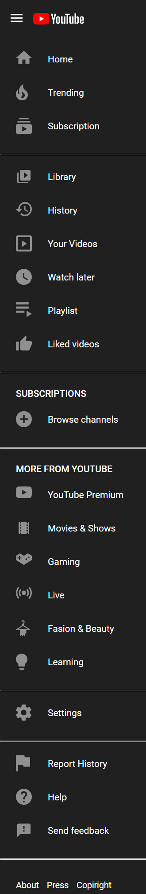

# YouTube Side Navigation Project

This repo is a companion repo to this video tutorial that shows you how to build a side navigation that looks similar to the side navigation of the popular video streaming platform YouTube.

# Commits of interest

| Commit Description             | Commit Hash                                                                                                                                      |
| ------------------------------ | ------------------------------------------------------------------------------------------------------------------------------------------------ |
| Initial project setup          | [c9fc2034373f2e990f5536954ad08baf6990026d](https://github.com/tjaartvanderWalt/youtube-side-nav/commit/c9fc2034373f2e990f5536954ad08baf6990026d) |
| Introducing webpack-server     | [894f517fd5778525b782904dc7167e6abe2078c8](https://github.com/tjaartvanderWalt/youtube-side-nav/commit/894f517fd5778525b782904dc7167e6abe2078c8) |
| Configure custom HTML template | [65c3d8eb965d70a85f8396dfe256e7a4b640513b](https://github.com/tjaartvanderWalt/youtube-side-nav/commit/65c3d8eb965d70a85f8396dfe256e7a4b640513b) |
| Building the main navigation   | [bb47ba3bf22b29950cc87a63d654b070e9c1da40](https://github.com/tjaartvanderWalt/youtube-side-nav/commit/bb47ba3bf22b29950cc87a63d654b070e9c1da40) |
| Building the side navigation   | [42946014a9a615bd30402e75ef317ad63fec5cea](https://github.com/tjaartvanderWalt/youtube-side-nav/commit/42946014a9a615bd30402e75ef317ad63fec5cea) |

## Files

| File Name                                              | Description                                                                                                             |
| ------------------------------------------------------ | ----------------------------------------------------------------------------------------------------------------------- |
| [YouTubeSideNav.fig](./figma-files/YouTubeSideNav.fig) | Figma file of side navigation that looks similar to the side navigation of the popular video streaming platform YouTube |
